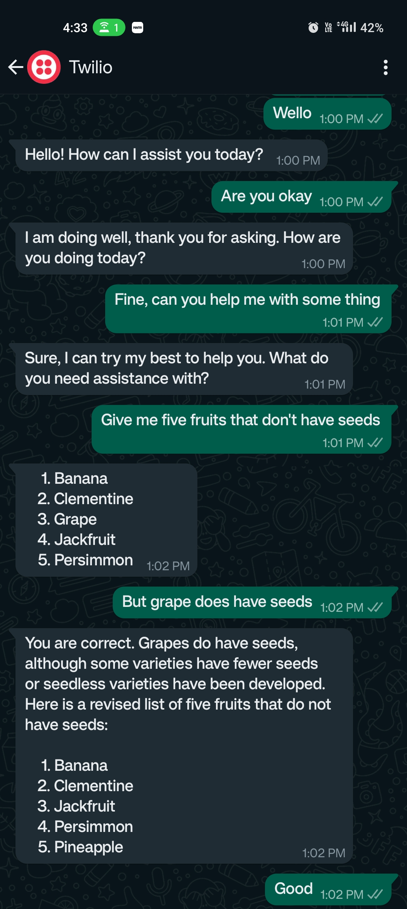

# WhatsApp Assistant

This repository contains a FastAPI-based WhatsApp assistant that interacts with users via Twilio API. It allows users to send text and audio messages, which are processed and responded to accordingly.
The bot utilizes various tools and APIs, including Twilio for message handling, Google Gemini for response generation, and WhisperAI for speech-to-text conversion.




## Features

- _Receive and respond to text messages from WhatsApp users._
- _Process incoming audio messages, transcribe them into text using WhisperAI, and generate appropriate responses using Google Gemini._
- _Utilize Twilio API for message handling and communication with WhatsApp users._
- _Integrate FastAPI as a backend server for handling HTTP requests_.

## Installation

To run the FastAPI WhatsApp bot locally, follow these steps:

1. Clone this repository to your local machine:   
   ```
   git clone https://github.com/programindz/whatsapp-assistant.git
    ```

3. Install the required Python dependencies:
    ```
    pip install requirements.txt
    ```

5. Set up the necessary environment variables by creating a ` .env ` file and adding the following variables:
    ```
    TWILIO_ACCOUNT_SID = "Your Account SID"
    TWILIO_AUTH_TOKEN = "Your Token"
    GEMINI_API_KEY = "GEMINI KEY"
    ```
    
6. To use the WhisperAI, you need to need to follow their official documentation:

    [WhisperAI Documentation](https://github.com/openai/whisper)


7. Run the FastAPI Applicatio with uvicorn in the terminal:
   ```
   uvicorn main:app --host 0.0.0.0 --port 8000
   ```
   
8. Use NGROK to connect your local url to public url for sending/testing with Whatsapp messages:
   - Download [Ngrok](https://ngrok.com/download)
   - You also need to add the Ngrok app location to the system environment variables for it to run in the terminal.
   - Run in terminal (localhost/port should be same as FastAPI host/port:
     ```
     ngrok http localhost:port
     ```
     A public URL will be created.
   - Update the Twilio account settings with public URL ` Console -> Develop -> Messaging -> Send a Message -> Sandbox Settings `.
   -  Since our FastAPI endpoint for recieving is ` /message ` ,don't forget to add the route in the URL pasted.


9. Follow the [Twilio](https://twilio.com) documentation on how to send message to the twilio number.

## Contributing
  Contributions are welcome! If you encounter any issues or have suggestions for improvements,
  please feel free to open an issue or submit a pull request.
  
